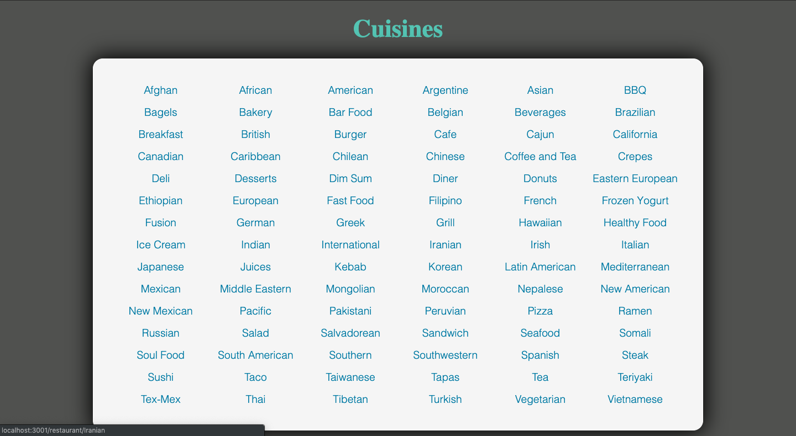
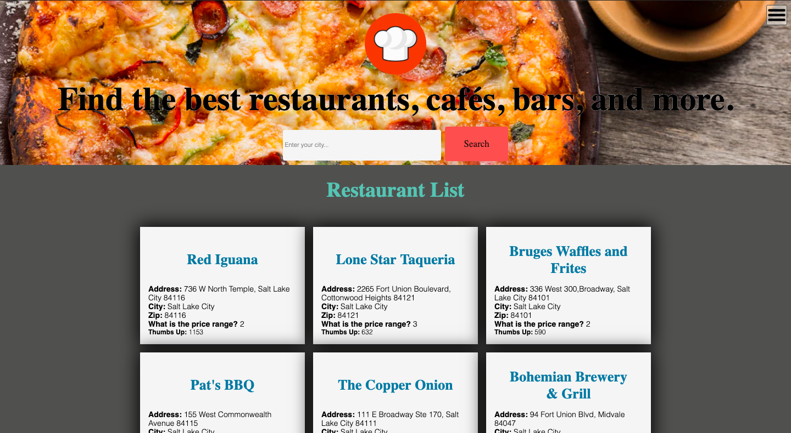

# Restaurant App
### > For V School // Full Stack JavaScript // January 2019 Cohort
#### Demo:
- <a href="myrestaurantapp.surge.sh" target="_blank">Restaurant App</a>
#### Completed according to assignment instructions: 
- https://coursework.vschool.io/personal-react-site/
#### Technologies Used
* HTML, Responsive CSS, CSS Transitions, JavaScript, React, Axios, Node.js, Zomato RESTful API,
#### Screenshot:

